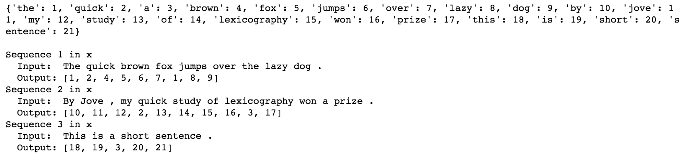
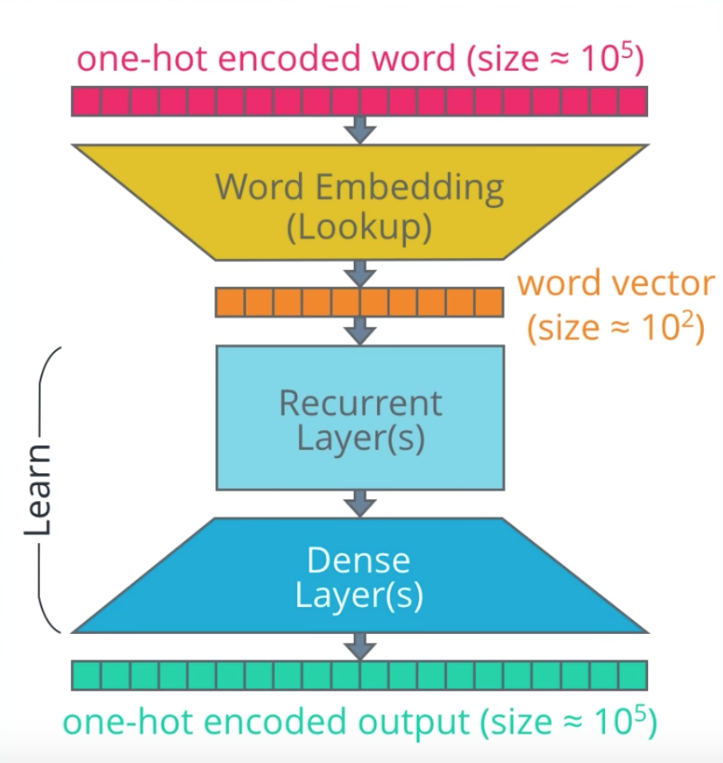
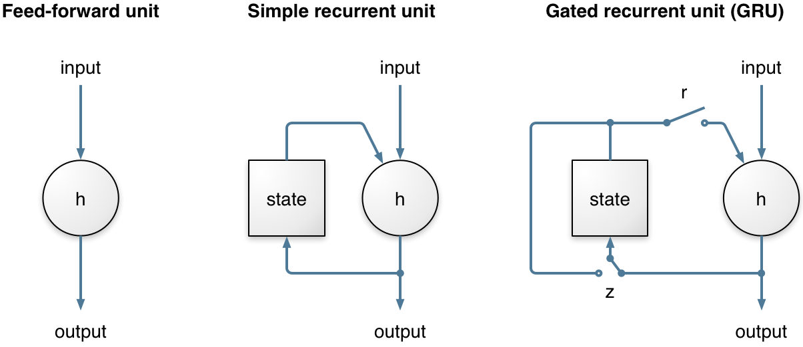

# Machine Translation with RNNs

##### &nbsp;

##### &nbsp;

## Goal
In this project, i build a deep neural network that functions as part of a machine translation pipeline. The pipeline accepts English text as input and returns the French translation. The goal is to achieve the highest translation accuracy possible.

##### &nbsp;

## Approach
To translate a corpus of English text to French, build a recurrent neural network (RNN).

### Building the Pipeline
Below is a summary of the various preprocessing and modeling steps. The high-level steps include:

1. **Preprocessing**: load and examine data, cleaning, tokenization, padding
1. **Modeling**: build, train, and test the model
1. **Prediction**: generate specific translations of English to French, and compare the output translations to the ground truth translations
1. **Iteration**: iterate on the model, experimenting with different architectures

### Toolset
i use Keras for the frontend and TensorFlow for the backend in this project. I

##### &nbsp;

## Preprocessing

### Load & Examine Data
Here is a sample of the data. The inputs are sentences in English; the outputs are the corresponding translations in French.

> 

##### &nbsp;

When we run a word count, we can see that the vocabulary for the dataset is quite small. This was by design for this project. This allows us to train the models in a reasonable time.

> 

### Cleaning
No additional cleaning needs to be done at this point. The data has already been converted to lowercase and split so that there are spaces between all words and punctuation.

_Note:_ For other NLP projects you may need to perform additional steps such as: remove HTML tags, remove stop words, remove punctuation or convert to tag representations, label the parts of speech, or perform entity extraction.  

### Tokenization
Next we need to tokenize the data&mdash;i.e., convert the text to numerical values. This allows the neural network to perform operations on the input data. For this project, each word and punctuation mark will be given a unique ID. (For other NLP projects, it might make sense to assign each character a unique ID.)

When we run the tokenizer, it creates a word index, which is then used to convert each sentence to a vector.

> 

### Padding
When we feed our sequences of word IDs into the model, each sequence needs to be the same length. To achieve this, padding is added to any sequence that is shorter than the max length (i.e. shorter than the longest sentence).

> 

### One-Hot Encoding (not used)
In this project,  input sequences will be a vector containing a series of integers. Each integer represents an English word (as seen above).

##### &nbsp;

## Modeling
First, let's breakdown the architecture of a RNN at a high level. Referring to the diagram above, there are a few parts of the model we to be aware of:

1. **Inputs** &mdash; Input sequences are fed into the model with one word for every time step. Each word is encoded as a unique integer or one-hot encoded vector that maps to the English dataset vocabulary.
1. **Embedding Layers** &mdash; Embeddings are used to convert each word to a vector. The size of the vector depends on the complexity of the vocabulary.
1. **Recurrent Layers (Encoder)** &mdash; This is where the context from word vectors in previous time steps is applied to the current word vector.
1. **Dense Layers (Decoder)** &mdash; These are typical fully connected layers used to decode the encoded input into the correct translation sequence.
1. **Outputs** &mdash; The outputs are returned as a sequence of integers or one-hot encoded vectors which can then be mapped to the French dataset vocabulary.

##### &nbsp;

### Embeddings
Embeddings allow us to capture more precise syntactic and semantic word relationships. This is achieved by projecting each word into n-dimensional space. Words with similar meanings occupy similar regions of this space; the closer two words are, the more similar they are. And often the vectors between words represent useful relationships, such as gender, verb tense, or even geopolitical relationships.

Training embeddings on a large dataset from scratch requires a huge amount of data and computation. So, instead of doing it ourselves, we'd normally use a pre-trained embeddings package such as [GloVe](https://nlp.stanford.edu/projects/glove/) or [word2vec](https://mubaris.com/2017/12/14/word2vec/). When used this way, embeddings are a form of transfer learning. However, since our dataset for this project has a small vocabulary and little syntactic variation, we'll use Keras to train the embeddings ourselves.

##### &nbsp;

### Encoder & Decoder
Our sequence-to-sequence model links two recurrent networks: an encoder and decoder. The encoder summarizes the input into a context variable, also called the state. This context is then decoded and the output sequence is generated.

##### &nbsp;

##### &nbsp;

Since both the encoder and decoder are recurrent, they have loops which process each part of the sequence at different time steps. 

In the example below, it takes four time steps to encode the entire input sequence. At each time step, the encoder "reads" the input word and performs a transformation on its hidden state. Then it passes that hidden state to the next time step.  hidden state represents the relevant context flowing through the network. The bigger the hidden state, the greater the learning capacity of the model, but also the greater the computation requirements. 

##### &nbsp;

For now, notice that for each time step after the first word in the sequence there are two inputs: the hidden state and a word from the sequence. For the encoder, it's the _next_ word in the input sequence. For the decoder, it's the _previous_ word from the output sequence.

Also, remember that when we refer to a "word," we really mean the _vector representation_ of the word which comes from the embedding layer.

##### &nbsp;

### Bidirectional Layer

To implement this, i train two RNN layers simultaneously. The first layer is fed the input sequence as-is and the second is fed a reversed copy.

##### &nbsp;

### Hidden Layer &mdash; Gated Recurrent Unit (GRU)
makde our RNN a little bit smarter. Instead of allowing _all_ of the information from the hidden state to flow through the network, what if we could be more selective? Perhaps some of the information is more relevant, while other information should be discarded. This is essentially what a gated recurrent unit (GRU) does.

There are two gates in a GRU: an update gate and reset gate. To summarize, the **update gate (z)** helps the model determine how much information from previous time steps needs to be passed along to the future. Meanwhile, the **reset gate (r)** decides how much of the past information to forget.

##### &nbsp;

##### &nbsp;

## Results
The results from the final model can be found in cell 20 of the .

Validation accuracy: 97.5%

Training time: 23 epochs
